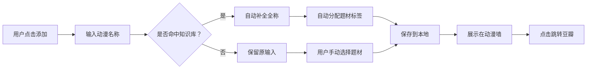

# 产品需求文档（PRD）

## 1. 产品概述

「番剧手帐」是一款面向个人动漫爱好者的本地动漫整理网站。用户可以持续添加自己观看过的日本动漫名称，网站会自动补全简称、归类题材标签，并提供一键跳转豆瓣评分页的功能，帮助用户建立一份美观、可检索的个人动漫档案。

核心价值：将碎片化的观影记录转化为结构化、可浏览、可分享的动漫收藏库。

## 2. 核心功能

### 2.1 用户角色

| 角色 | 注册方式 | 核心权限 |
|------|----------|----------|
| 站长/个人用户 | 无需注册，本地使用 | 添加、编辑、删除、分类、浏览动漫记录 |

### 2.2 功能模块

1. **首页 / 动漫墙**：展示所有已收录动漫卡片，支持按题材筛选与搜索。
2. **添加动漫**：输入动漫名称（支持简称），系统自动补全全称并推荐题材标签。
3. **动漫详情卡片**：显示封面占位图、完整名称、题材标签、豆瓣评分入口。
4. **分类视图**：按恋爱、热血、悬疑、科幻、日常等题材归类展示。
5. **数据管理**：数据持久化存储在浏览器本地，支持导入/导出备份（后期可扩展）。

### 2.3 页面详情

| 页面名称 | 模块名称 | 功能描述 |
|----------|----------|----------|
| 首页 | 英雄区（Hero） | 展示站点标题、简介、已收录数量与快速添加入口 |
| 首页 | 筛选栏 | 搜索框 + 题材标签筛选 + 排序切换 |
| 首页 | 动漫卡片网格 | 卡片式展示动漫，悬停显示豆瓣评分入口 |
| 首页 | 添加弹窗 | 输入动漫名称，实时补全建议，选择/确认题材标签 |
| 分类页 | 分类列表 | 按题材聚合展示动漫，支持展开/折叠 |

## 3. 核心流程

### 3.1 添加动漫流程

1. 用户在首页点击「添加动漫」按钮。
2. 弹出添加面板，用户输入动漫名称（可以是简称，如「你的名字」）。
3. 系统根据本地动漫知识库进行模糊匹配，实时显示补全建议（如「你的名字。 / 君の名は。」）。
4. 用户选择建议或保留原输入。
5. 系统根据知识库自动打上题材标签；若知识库未命中，则标记为「未分类」，用户可手动选择。
6. 点击保存后，动漫卡片出现在首页墙与对应分类中。
7. 点击卡片标题，新标签页打开豆瓣动漫搜索/评分页面。

### 3.2 浏览与筛选流程

1. 用户进入首页，顶部展示所有题材标签。
2. 点击标签后，动漫墙仅显示该题材动漫。
3. 搜索框支持按名称、简称、标签实时过滤。
4. 点击任意卡片标题，跳转豆瓣对应页面。

## 4. 用户界面设计

### 4.1 设计风格

- **整体方向**：日式编辑风（Editorial / Magazine）+ 温和数字感。既像一本可翻阅的动漫手帐，又具备现代 Web 应用的交互效率。
- **主色调**：
  - 背景：`#FDF8F3`（米白，类似和纸质感）
  - 主色：`#2E2658`（深靛蓝，沉稳）
  - 强调色：`#FF6B6B`（珊瑚红，活泼）
  - 辅助色：`#4ECDC4`（青绿）、`#FFE66D`（明黄）用于题材标签
- **按钮样式**：大圆角药丸形，主按钮使用深靛蓝背景 + 白色文字，悬停时轻微上浮并投射柔和阴影。
- **字体**：
  - 标题字体：「Zen Maru Gothic」或「Noto Serif JP」——圆润、有日系杂志感。
  - 正文字体：系统无衬线字体栈，保证可读性。
- **布局风格**：非对称网格 +  generous 留白。顶部为 hero 区，中部为筛选栏，下方为错落卡片网格（masonry 效果）。
- **图标/插画**：使用简洁的线性图标，封面图未上传时显示渐变色占位块 + 首字母大字。

### 4.2 页面设计概览

| 页面名称 | 模块名称 | UI 元素 |
|----------|----------|---------|
| 首页 | Hero 区 | 左侧大标题 + 副文案，右侧装饰性动漫几何图形，底部统计数字 |
| 首页 | 筛选栏 | 圆角搜索框、横向可滚动题材标签、排序下拉 |
| 首页 | 动漫卡片 | 封面图/渐变色占位、完整名称、题材标签、豆瓣入口图标 |
| 首页 | 添加弹窗 | 模态层、名称输入、实时建议列表、标签选择器、保存按钮 |
| 分类页 | 分类列表 | 手风琴式题材分区，内部为横向卡片滚动 |

### 4.3 动画与微交互

- **页面加载**：标题与卡片依次淡入上浮，使用交错延迟（stagger）。
- **卡片悬停**：轻微放大（scale 1.02）、阴影加深、封面图亮度提升。
- **标签筛选**：点击标签后，卡片网格以淡入淡出方式重新排列。
- **添加成功**：卡片从上方滑入并伴随轻微弹跳。
- **无结果状态**：展示可爱的空白插画提示。

### 4.4 响应式设计

- **桌面优先**：三列及以上卡片网格，Hero 区左右分栏。
- **平板**：两列网格，筛选栏换行。
- **手机**：单列网格，标签横向滚动，添加按钮悬浮于右下角。

### 4.5 3D 场景指导

本项目为信息展示型应用，无需 3D 场景。
