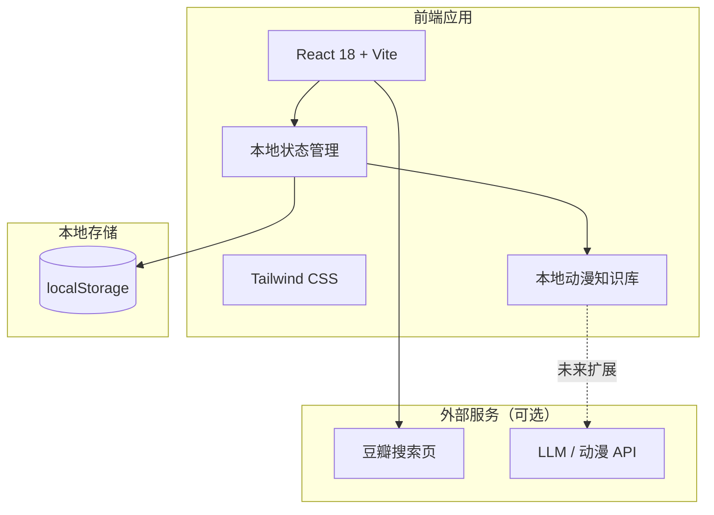

# 技术架构文档

## 1. 架构设计



- **纯前端应用**：无需后端服务器与数据库，数据通过 `localStorage` 持久化。
- **本地知识库**：内置一份常见日本动漫的映射表（名称、简称、题材标签），用于自动补全与分类。
- **外部链接**：豆瓣评分页通过豆瓣搜索链接模板跳转，不依赖豆瓣公开 API。
- **可扩展点**：预留 AI/LLM 或第三方动漫 API（AniList、Bangumi）接入位置，未来可升级自动分类能力。

## 2. 技术选型

| 层级 | 技术 | 说明 |
|------|------|------|
| 前端框架 | React 18 | 组件化开发，生态成熟 |
| 构建工具 | Vite | 快速冷启动与热更新 |
| 样式方案 | Tailwind CSS 3 | 原子化 CSS，便于快速实现设计系统 |
| 状态管理 | React Hooks + Context | 本项目数据量小，无需 Redux/Zustand |
| 数据持久化 | localStorage | 单用户本地使用，零部署成本 |
| 图标 | Lucide React | 简洁线性图标 |
| 字体 | Google Fonts（Zen Maru Gothic / Noto Serif JP） | 通过 CDN 引入 |

## 3. 路由定义

| 路由 | 用途 |
|------|------|
| `/` | 首页：动漫墙、筛选、添加入口 |
| `/categories` | 分类页：按题材聚合展示 |
| `/about` | 关于页：使用说明与数据备份入口（可选） |

## 4. 核心数据结构

### 4.1 动漫记录（AnimeItem）

```typescript
interface AnimeItem {
  id: string;           // 唯一标识（UUID 或时间戳）
  displayName: string;  // 完整名称（自动补全后）
  originalInput: string; // 用户输入的原始名称
  genres: string[];     // 题材标签，如 ['恋爱', '校园']
  coverUrl?: string;    // 封面图 URL（后期功能）
  doubanUrl: string;    // 豆瓣搜索/评分页链接
  createdAt: number;    // 添加时间戳
  updatedAt: number;    // 更新时间戳
}
```

### 4.2 本地知识库条目（AnimeKnowledge）

```typescript
interface AnimeKnowledge {
  aliases: string[];    // 简称、别称列表
  fullName: string;     // 完整官方名称
  genres: string[];     // 标准题材标签
}
```

### 4.3 题材标签常量

```typescript
const GENRES = [
  '恋爱', '热血', '悬疑', '科幻', '奇幻',
  '日常', '运动', '音乐', '机战', '治愈',
  '搞笑', '冒险', '恐怖', '推理', '未分类'
];
```

## 5. 自动补全与分类机制

### 5.1 是否需要调用 AI 大模型？

**当前版本不需要。** 原因如下：

1. **本地知识库已覆盖常见动漫**：对于用户常看的日本动漫，可以通过内置映射表直接补全名称并分配题材。
2. **零成本、零延迟、可离线**：不调用外部 API，打开即用，响应极快。
3. **隐私安全**：观影记录不会上传到任何第三方服务。

**何时需要 AI/外部 API？**

| 方案 | 优点 | 缺点 | 适用场景 |
|------|------|------|----------|
| 本地知识库（当前） | 免费、快速、离线、隐私 | 需要手动维护映射表 | 个人使用、常见番剧 |
| 调用 LLM（OpenAI/Claude 等） | 泛化能力强，可识别冷门番 | 需要 API Key、有费用、有延迟 | 知识库未命中时的兜底 |
| 调用动漫 API（AniList/Bangumi） | 数据准确、可获取封面 | 依赖网络与第三方服务稳定性 | 自动补全封面、评分、年代 |

**建议架构**：以本地知识库为主，当输入未命中时，提供「手动选择题材」并提示用户未来可接入 AI 自动识别。这样既满足当前需求，又保留扩展空间。

### 5.2 补全算法

1. 用户输入 `query`。
2. 在知识库 `aliases` 与 `fullName` 中进行子串匹配与模糊匹配（如包含关系或编辑距离 ≤ 2）。
3. 返回匹配度最高的前 5 条建议。
4. 用户选择建议后，自动填充 `displayName` 与 `genres`。

### 5.3 豆瓣链接生成

由于豆瓣没有提供稳定的动漫详情 API，使用豆瓣搜索链接模板：

```
https://www.douban.com/search?q={encodeURIComponent(fullName)}
```

用户点击卡片标题后，在新标签页打开该搜索页，可手动找到对应评分条目。

## 6. 组件结构

```
src/
├── components/
│   ├── Hero.tsx              # 顶部英雄区
│   ├── FilterBar.tsx         # 搜索 + 标签筛选
│   ├── AnimeGrid.tsx         # 动漫卡片网格
│   ├── AnimeCard.tsx         # 单个动漫卡片
│   ├── AddAnimeModal.tsx     # 添加动漫弹窗
│   ├── GenreTag.tsx          # 题材标签
│   └── EmptyState.tsx        # 空状态提示
├── data/
│   └── animeKnowledge.ts     # 本地动漫知识库
├── hooks/
│   ├── useAnimeStorage.ts    # localStorage 读写
│   └── useAutoComplete.ts    # 自动补全逻辑
├── types/
│   └── index.ts              # TypeScript 类型定义
├── App.tsx                   # 主应用
└── main.tsx                  # 入口文件
```

## 7. 数据持久化策略

- 使用 `localStorage` 键名：`anime-collection`。
- 每次增删改后，将 `AnimeItem[]` 序列化为 JSON 写入。
- 应用启动时读取并解析，若解析失败则回退到空数组。
- 预留导出功能：将 localStorage 数据下载为 JSON 文件备份。

## 8. 性能考量

- 知识库大小控制在数百至数千条，前端内存加载无压力。
- 自动补全使用防抖（debounce）输入，避免频繁计算。
- 卡片网格使用 CSS Grid + `will-change` 优化动画性能。
- 封面图懒加载（后期接入真实图片时使用 `loading="lazy"`）。
